

  <a href="https://unform.dev">
    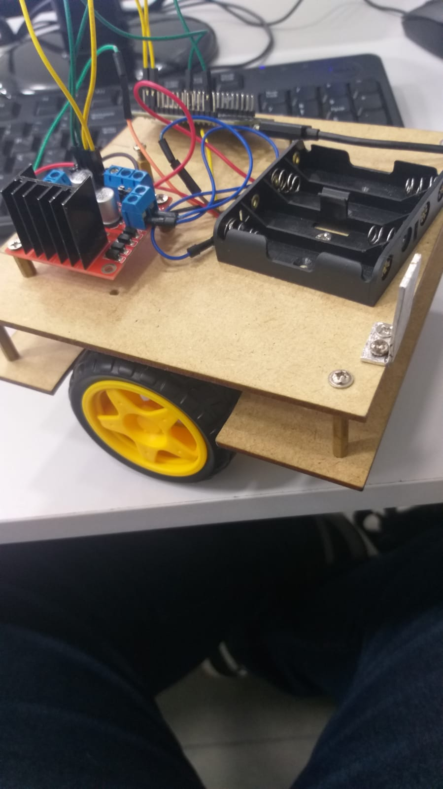
  </a>

<h1 align="center">Robo de futebol com controle</h1> 

Robo feito com ESP8266 como forma de avaliação da "Tópicos especiais em robótica".

Tabela de conteúdos
=================
<!--ts-->
   * [Sobre](#Sobre)
      * [Fotos do projeto](#fotos)
   * [Peças](#Peças)
   * [Competição](#Competição)
<!--te-->

<h4 align="center"> 
      	✔️  Pronto  ✔️
</h4>

## Sobre 

+ O codigo do carrinho foi desenvolvido por terceiros e modificado conforme o andamento do trabalho.

+ Foi desenvolvido com a IDE do Arduino utilizando a biblioteca da placa esp8266.

+ Foi desenvolvido como parte principal da materia de  

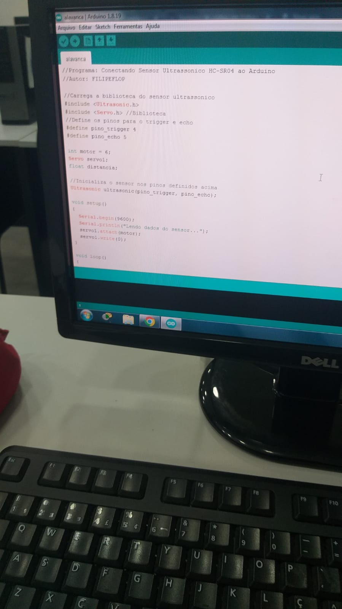

## fotos

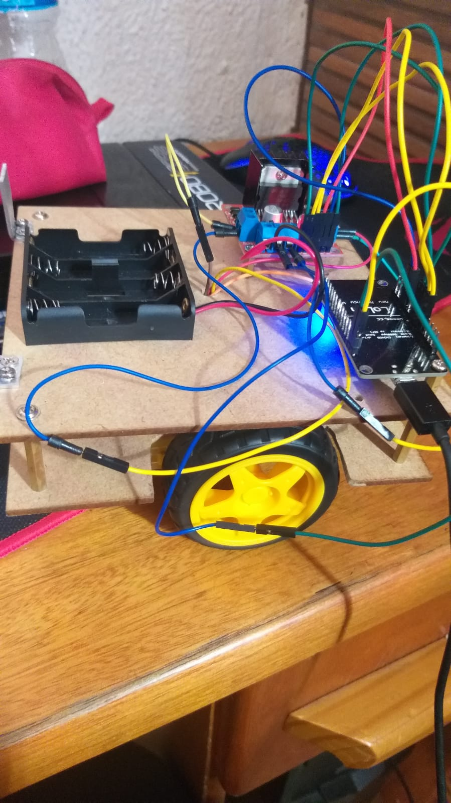
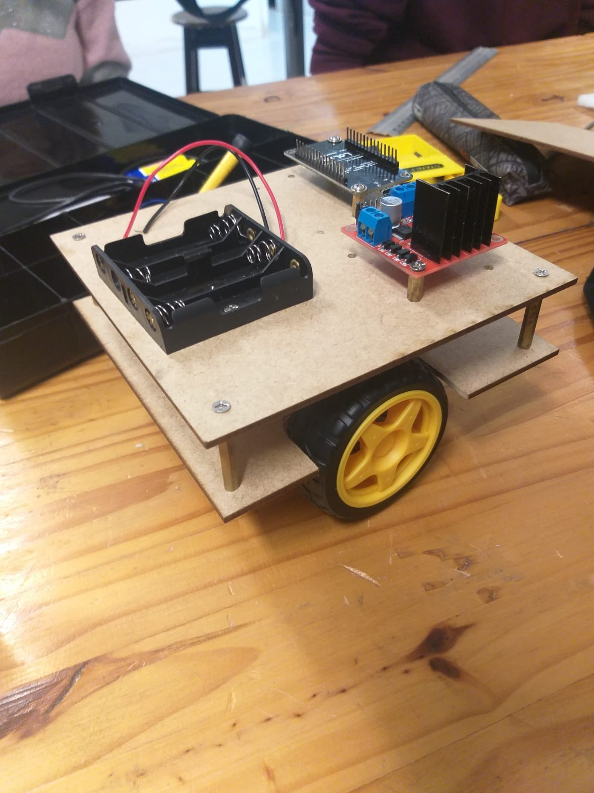
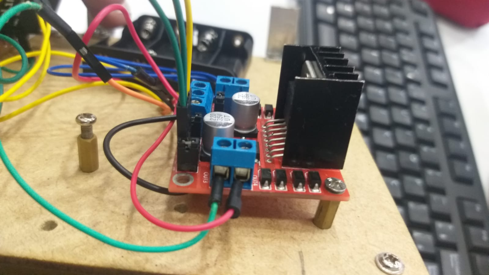
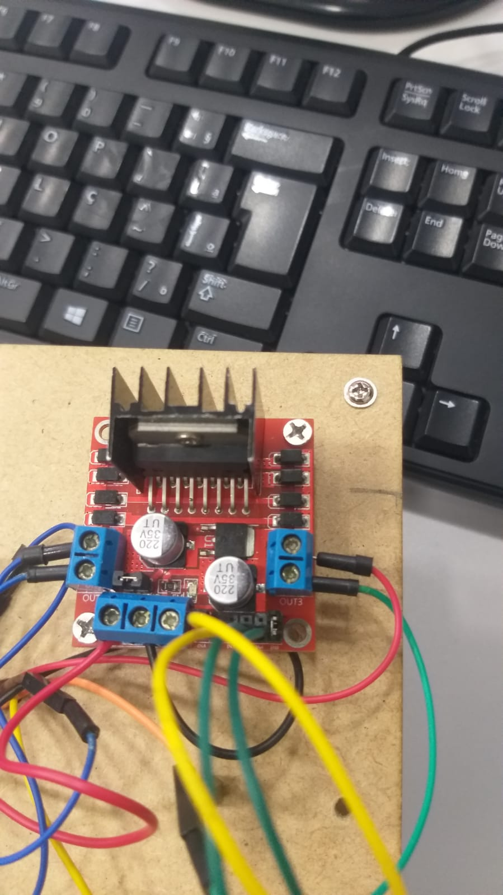
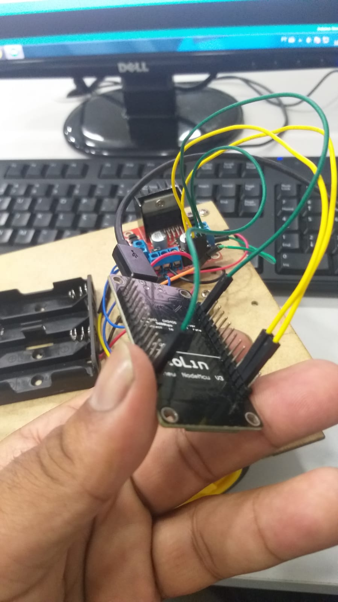
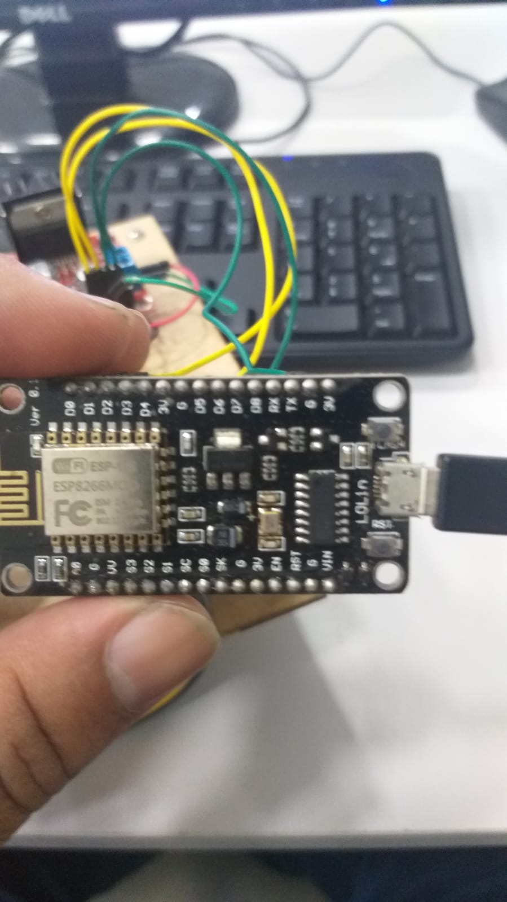
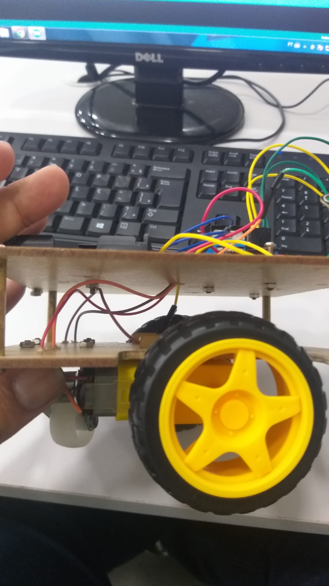
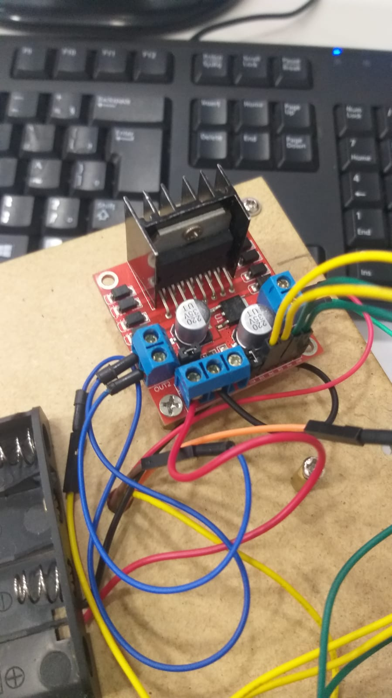
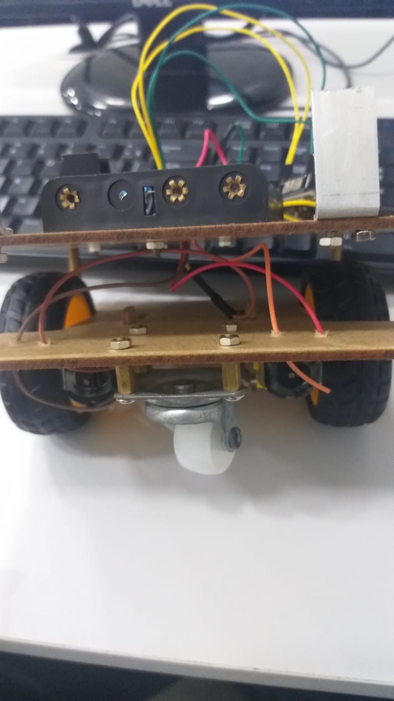
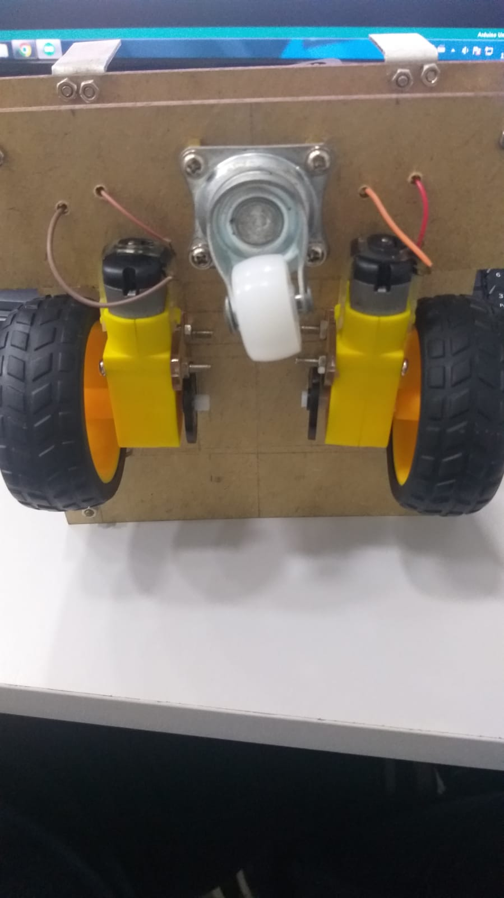
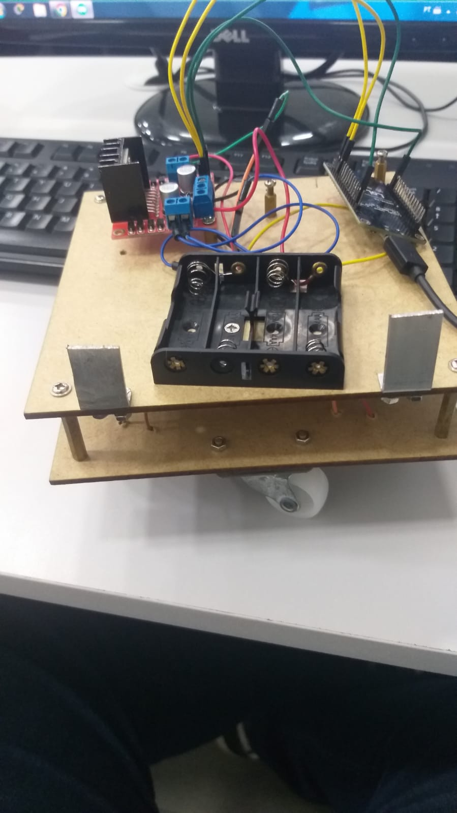

## Peças 

<i>
As peças foram compradas e utilizadas no ano de 2022 nem todas as peças foram compradas pois foram providas pela faculdade UNISAL na unidade de Lorena
</i>

### Amazon:

Node MCU ESP8266(CP2102): 

    https://www.amazon.com.br/ESP8266-CH340G-NodeMcu-desenvolvimento-Internet/dp/B08H26NY16/ref=sr_1_7?__mk_pt_BR=ÅMÅŽÕÑ&crid=CXHZJW4EAXUU&keywords=ESP8266%5D&qid=1655392792&sprefix=esp8266%2Caps%2C513&sr=8-7&ufe=app_do%3Aamzn1.fos.6d798eae-cadf-45de-946a-f477d47705b9

L298N Motor Driver (Ponte H): 
  
    https://www.amazon.com.br/Motorista-unidade-Channel-Anti-interferência-inteligente/dp/B07TJ8MG5L/ref=sr_1_3?__mk_pt_BR=ÅMÅŽÕÑ&crid=2MH79OI7Z7YL5&keywords=L298N+Motor+Driver&qid=1655393361&sprefix=l298n+motor+driver%2Caps%2C504&sr=8-3

### Mercado Livre:

Motor DC : 
  
    https://produto.mercadolivre.com.br/MLB-1690062488-motor-dc-3v-a-6v-caixa-de-reduco-e-eixo-duplo-p-robotica-_JM#position=1&search_layout=stack&type=item&tracking_id=3857862b-fbea-48e4-8476-eb1aa318439e

Motor DC com a rodinha:  
  
    https://produto.mercadolivre.com.br/MLB-985658069-motor-dc-3-6v-com-caixa-de-reduco-e-eixo-duplo-roda-68mm-_JM#position=1&search_layout=stack&type=pad&tracking_id=14a7b200-d40a-44c8-90bb-49b564fc59b0#position=1&search_layout=stack&type=pad&tracking_id=14a7b200-d40a-44c8-90bb-49b564fc59b0&is_advertising=true&ad_domain=VQCATCORE_LST&ad_position=1&ad_click_id=NDY0YjUxM2MtNWYxNi00MDEyLWJlN2MtNzk3ZGQxZjQ3ODAy

  Bateria de Litio ( Não usei mas poderia ter usado): 
  
    https://produto.mercadolivre.com.br/MLB-1836312255-bateria-lipo-2s-74v-1100mah-_JM?matt_tool=68334988&matt_word=&matt_source=google&matt_campaign_id=14300471977&matt_ad_group_id=127611134282&matt_match_type=&matt_network=g&matt_device=c&matt_creative=539425454152&matt_keyword=&matt_ad_position=&matt_ad_type=pla&matt_merchant_id=139086577&matt_product_id=MLB1836312255&matt_product_partition_id=1405741786548&matt_target_id=pla-1405741786548&gclid=CjwKCAjwqauVBhBGEiwAXOepkcmRPgjzFtEYJLXsQOuOiQLVywc58nx_64DDHTuq1WAbXe5siGUwjBoCVNAQAvD_BwE

  Suporte de bateria: 
  
    https://produto.mercadolivre.com.br/MLB-1521411673-suporte-case-porta-4-baterias-18650-para-arduino-esp8266-_JM#position=4&search_layout=grid&type=item&tracking_id=15e426b8-5348-4dc8-bedc-38d20ba5a403
  
  Jumper Wire: 
  
    https://produto.mercadolivre.com.br/MLB-2137220322-cabo-wire-jumper-20cm-40-fios-fmea-macho-protoboard-arduino-_JM#position=3&search_layout=stack&type=item&tracking_id=5f164f68-6c02-4d1d-98ab-4f8566055ab9

## Competição

+ Alguns problemas ocorreram no dia da apresentação como:
 
    1) Perde de sinal entre o ESP8266 e o controle.
    2) Quebra do motor DC esquerdo.

+ Apesar dos problemas grande parte foi resolvido na hora do evento.
+ Fotos e videos foram dispostos abaixo:

Link da 1 partida do carrinho: 
  
    https://www.youtube.com/watch?v=AXjlCA3nseY